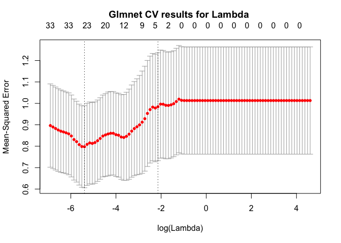

PART A: Code for the majorization algorithm of the elastic net
--------------------------------------------------------------

The function is shown below.

``` r
# DESCRIPTION: Majorization algorithm for the elastic net
# INPUTS
# X: A general matrix containing the predictor variables (not a df)
# y: The dependant variable
# lambda: Strength of the penalty term, default is set equal to 0.1
# alpha: mixing paramater of Ridge and LASSO, default is set equal to 1 (LASSO)
# verbose: control output of updating during algorithm, default is TRUE
# message: control message of convergence after stopping, default is TRUE
# epsilon: stopping criterium, if the relative improvement falls below this threshold
# the algorithm is stopped. Default is set equal to 1e-8
# OUTPUTS
# b: vector with regression weights

elasticnet <- function(X, y, lambda = 0.1, alpha = 1, epsilon = 1e-8, verbose = T, message = T) {
  # Start timer to log computation time
  begin_time <- Sys.time()
  # Dimensions of the data
  m <- dim(x)[2]
  n <- dim(x)[1]
  # Initialize some b vector, we use a vector with ones
  b <- rep(1, m)
  # Calculate initial L_en
  c <- (2*n)^(-1) * t(y)%*%y + lambda*(alpha/2*sum(abs(b)))
  d_jj <- as.vector(1/(2*pmax(abs(b),epsilon)))
  D <- diag(d_jj,m,m)
  I <- diag(1,m,m)
  L_en <- numeric(0)
  L_en <- t(b) %*% ((2*n)^(-1) * t(X) %*% X + 
                      (lambda*(1-alpha)/2*I+lambda*alpha*D)) %*% b -
    (2*n)^(-1) *t(b) %*% t(X) %*% y + c
  # Update estimates, repeat until stopping condition is met
  t <- 1
  repeat {
    t <- t+1
    A <- (2*n)^(-1) * t(X)%*%X + (lambda*(1-alpha)/2)*I + lambda*alpha*D
    b <- solve(A, t(X)%*%y * (2*n)^-1)
    c <- (2*n)^(-1) *t(y)%*%y + lambda*(alpha/2*sum(abs(b)))
    d_jj <- as.vector(1/(2*pmax(abs(b),epsilon)))
    D <- diag(d_jj,m,m)
    L_en[t] <- t(b) %*% ((2*n)^(-1) * t(X) %*% X + 
                      (lambda*(1-alpha)/2*I+lambda*alpha*D)) %*% b -
    (2*n)^(-1) *t(b) %*% t(X) %*% y + c
    # If verbose is TRUE, print out iterations to console
    if (verbose == T) {    
      print(paste("Iteration:", t, "L_en:", format(L_en[t]), "Difference:", 
                  format(L_en[t-1]-L_en[t])))
    }
    # When relative improvement is smaller than epsilon stop the algorithm
    if ((L_en[t-1]-L_en[t])/L_en[t-1] <= epsilon) {
      break
    }
  }
  # Print information message after converging
  if (message == T) { 
    print(paste("Converged in", t, "iterations taking", format(Sys.time() - begin_time)))
  }
  return(b)
}
```

PART B: Code for testing the implementation
-------------------------------------------

Next, we test our function using some data regarding supermarkets. The
following values for the parameters are used: *α*=1 which yields the
LASSO penalty and the penalty strength *λ* = 0.1. Furthermore,
*ϵ* = 1*e* − 8 is used in the stopping condition. Lastly,
*v**e**r**b**o**s**e* = *F* which disables printing the results of each
iteration. Only a single line is printed reporting the computation time
and iteration amount.

``` r
load("supermarket1996.RData")
# Select predictor variables age9 to shpindx
x <- as.matrix(supermarket1996[ ,c(6:50)])
# Define dependant variable
y <- as.vector(supermarket1996$GROCCOUP_sum)
# Scale data
x <- scale(x)
y <- scale(y)
# Calculate coefficients
shrink_results <- elasticnet(x, y, lambda=0.1, verbose=F)
```

    ## [1] "Converged in 890 iterations taking 0.4656291 secs"

### Comparison with glmnet package results

The results of our own function is compared with the results of the
glmnet package. **Table 1** below reports the coefficients estimates
rounded to 3 decimal places after shrinkage with the LASSO in both
approaches. We find that exactly the same variables are excluded by
shrinking their effect down to zero. This can be interpreted as variable
selection. The fact that the same variables are selected in both
approaches confirms satisfactory behavior of our own function.

``` r
glmnet_results <- glmnet(x, y, alpha = 1, lambda = 0.1,
                         standardize = FALSE, intercept = FALSE)
est_comparison = as.data.frame(cbind(shrink_results, as.matrix(glmnet_results$beta)))
colnames(est_comparison) = c("Own function", "Glmnet package")
```

We find the following effects on the total US dollars redeemed through
grocery coupons. % of population under the age has 9, % of households
with a single person, % of non working women with children, % of avid
shoppers all have a negative effect. % of households with value over
$200.000, % of working women with children under the age of 5 and % of
non-white population have a positive effect.

``` r
kable(round(est_comparison, 3), caption="Comparison of coefficient estimates")
```

|          |  Own function|  Glmnet package|
|----------|-------------:|---------------:|
| AGE9     |        -0.004|          -0.003|
| AGE60    |         0.000|           0.000|
| ETHNIC   |         0.000|           0.000|
| EDUC     |         0.000|           0.000|
| NOCAR    |         0.000|           0.000|
| INCOME   |         0.000|           0.000|
| INCSIGMA |         0.000|           0.000|
| HSIZEAVG |         0.000|           0.000|
| HSIZE1   |         0.000|           0.000|
| HSIZE2   |         0.000|           0.000|
| HSIZE34  |         0.000|           0.000|
| HSIZE567 |         0.000|           0.000|
| HH3PLUS  |         0.000|           0.000|
| HH4PLUS  |         0.000|           0.000|
| HHSINGLE |         0.000|           0.000|
| HHLARGE  |         0.000|           0.000|
| WORKWOM  |         0.000|           0.000|
| SINHOUSE |        -0.100|          -0.100|
| DENSITY  |         0.000|           0.000|
| HVAL150  |         0.000|           0.000|
| HVAL200  |         0.005|           0.004|
| HVALMEAN |         0.000|           0.000|
| SINGLE   |         0.000|           0.000|
| RETIRED  |         0.000|           0.000|
| UNEMP    |         0.000|           0.000|
| WRKCH5   |         0.000|           0.000|
| WRKCH17  |         0.000|           0.000|
| NWRKCH5  |         0.000|           0.000|
| NWRKCH17 |        -0.101|          -0.101|
| WRKCH    |         0.000|           0.000|
| NWRKCH   |         0.000|           0.000|
| WRKWCH   |         0.099|           0.099|
| WRKWNCH  |         0.000|           0.000|
| TELEPHN  |         0.000|           0.000|
| MORTGAGE |         0.000|           0.000|
| NWHITE   |         0.005|           0.004|
| POVERTY  |         0.000|           0.000|
| SHPCONS  |         0.000|           0.000|
| SHPHURR  |         0.000|           0.000|
| SHPAVID  |        -0.112|          -0.114|
| SHPKSTR  |         0.000|           0.000|
| SHPUNFT  |         0.000|           0.000|
| SHPBIRD  |         0.000|           0.000|
| SHOPINDX |         0.000|           0.000|
| SHPINDX  |         0.000|           0.000|

Let’s test predictive peformance of both approaches. First, we split the
data into a random training and testing set in a 70/30 ratio.
Consequently, we predict on the same set using both the standard glmnet
package and our own function. Thereafter predictive perfomance is
compared based on the RMSE. We find the glmnet package performs slightly
better, but again results are comparable.

``` r
# Split data 70/30
set.seed(2017)
ind <- sample(1:nrow(x), nrow(x)/7)
x_train <- x[ind, ]
y_train <- y[ind]
x_test  <- x[-ind, ]
y_test  <- y[-ind]
# Predict and compare results
fit_own = glm(y ~ x, family = gaussian) # create fit to predict with
fit_own$coefficients <- shrink_results # force coef estimates from our own function
yhat_own <- predict(fit_own, newx = x_test) # predict with own coef estimates
yhat_glm <- predict(glmnet_results, newx = x_test) # predict with glmnet coefs
RMSE <- function(y, yhat){(mean((y - yhat)^2))^.5} # compare results
cat("Own function prediction RMSE: ", formatC(RMSE(y_train,yhat_own), 
                                   format = "f", digits = 3), "\n",
    "Glmnet package prediction RMSE:", formatC(RMSE(y_train,yhat_glm), 
                                  format = "f", digits = 3), "\n")
```

    ## Own function prediction RMSE:  1.173 
    ##  Glmnet package prediction RMSE: 0.870

PART C: Cross-Validation
------------------------

Thus far estimation has been done with an arbitrarily chosen value for
the penaly strenght paramater *λ*. To find an optimal value for *λ* we
can use cross-validation. The following code will perform leave-one-out
cross-validation to find a proper value.

``` r
# Predefine the y holdout and the sum of squared errors
y_ho <- numeric(0)
SSQ <- numeric(0)
P <- 100 # use a sequence of 100 lambda's
lambda <- 10^seq(-3, 2, length.out = P)

# Dimensions of the data
m <- dim(x)[2]
n <- dim(x)[1]

for (p in 1:P) {
  for (k in 1:n) {
    Xtrain <- x[-k, ] # Xtrain is the whole set minus X_k (leave-one-out)
    ytrain <- y[-k] # ytrain is the whole y set minus y_k (leave on out)
    # get the estimated b from the elastic net function
    b_hat <- elasticnet(x, y, lambda=lambda[p], verbose = F, message = F) 
    y_ho[k] <- x[k,] %*% b_hat # in this case X hold out is the X_k (leave-one-out)
  }
  SSQ[p] <- sum((y-y_ho) * (y-y_ho))
}

lambda_opt <- lambda[which.min(SSQ)]
print(paste("Lambda min:", round(lambda_opt, 3)))
```

    ## [1] "Lambda min: 0.001"

PART D: Comparison with glmnet package
--------------------------------------

Again, we compare the results of our own function with the output of the
glmnet package. We perform the cross-validation with the same lambda
sequence in both approaches.The number of folds is set equal to the
amount of observations, as result leave-one-out cross-validation is
performed. Results are comparable. As the value is relatively small
better results could potentially be obtained by testing a longer
sequence of lambda’s.

``` r
glmnet_cv <- cv.glmnet(x, y, alpha = 1, lambda = 10^seq(-3, 2, length.out = 100), 
                       nfolds = dim(x)[1], standardize = FALSE, intercept = TRUE)
```

    ## Warning: Option grouped=FALSE enforced in cv.glmnet, since < 3 observations
    ## per fold

``` r
print(paste("Lambda min:", round(glmnet_cv$lambda.min, 3)))  # Best cross validated lambda
```

    ## [1] "Lambda min: 0.005"

``` r
plot(glmnet_cv, main="Glmnet CV results for Lambda \n") # Plot lambda CV from glmnet
```


