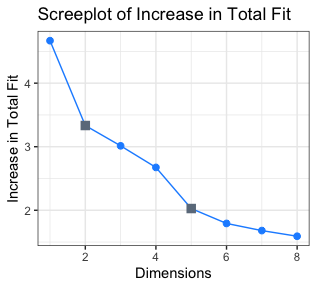
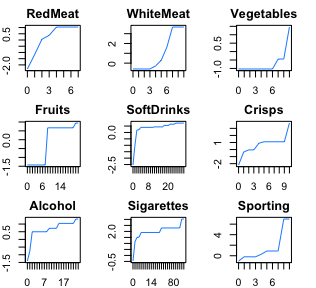
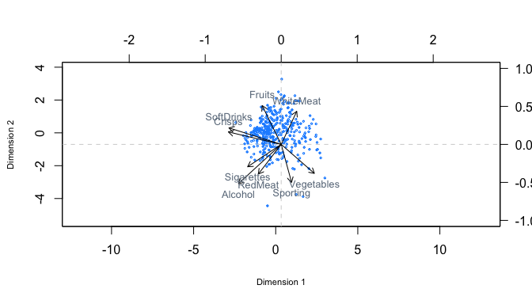
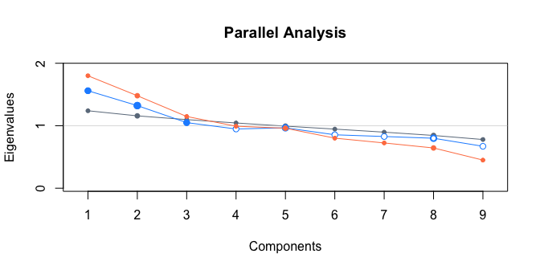

**INTRODUCTION**

When it comes to food in current society, people have different
consumption patterns. The offer is overwhelming and choices are
infinite. In this report we attempt to explore underlying patterns in
food consumption. For instance, does someone who frequently eats red
meat, also tend to eat white meat? Or does someone who frequently eats
fruit also do sports and avoids cigarettes or alcohol? Thus, this report
aims to answer the following research question:

**What relationships can we find in food consumption and lifestyle
habits based on consumer data?**

 

**DATA**

This report analyses data gathered by a researcher from RSM regarding
consumption. The dataset contains information of 390 individuals who
were asked how many times a week they eat from different food groups
along with how often they drink alcohol, smoke cigarettes and exercise.
**Table 1** gives an overview of the 9 variables and a row of
observations belonging to one individual. For example, this person eats
a meal containing 4 times and smokes 30 per week. The data does not
contain missing values. It is likely that certain variables will be
related with each other. Our aim is to explore the relationships between
the consumption of different food types and also in relation to
healthy/non-healthy habits such as sports and smoking. For example, we
expect people who exercise a lot to be more cautious of their health,
thus less likely to smoke many or drink often. We will treat each
variable as ordinal. After all, the number of meals or units per food
group does not tell us how much food they exactly consumed, and the
number of times an individual exercises per week does not tell us how
long or intensively they worked out. This means that the variables are
not numerical, as they are not measured on an equally spaced scale.

|  RedMeat|  WhiteMeat|  Vegetables|  Fruits|  SoftDrinks|  Crisps|  Alcohol|  Sigarettes|  Sporting|
|--------:|----------:|-----------:|-------:|-----------:|-------:|--------:|-----------:|---------:|
|        4|          3|           7|       4|          10|       1|       25|          30|         2|

**METHODOLOGY**

The goal is to explore relationships in our dataset. A proven technique
to reveal patterns and capture maximal variance in as few dimensions
possible is principal component analysis (PCA) \[Pearson, 1901\].
However, linear PCA has some limitations. First, the relationship
between variables is assumed to be linear. This is not always the case,
for example data sets with Likert-scale type variables. Second, as PCA
uses variance maximization, the variables need to be on a numeric scale.
When variables are non-numerical, the distance between several data
points may not be accurate and therefore computing the variance does not
make much sense \[Linting, 2007\]. Both limitations are overcome by an
extension called nonlinear PCA \[Scholz, 2005\]. Nonlinear PCA has the
ability to explore relations between categorical variables and can be
used when measurement levels of the variables are non-numerical. In
addition, nonlinear relations can be explored and observations with some
missing values can still be taken into account \[Linting, 2007\].
Nonlinear PCA transforms each level of a categorical variable into a
numerical value through optimal quantification and then computes the
correlations between these quantified variables \[Linting, 2007\]. The
quantified variables possess variance in the same way as numeric
variables, therefore nonlinear PCA can achieve the same objective as
linear PCA but for quantified categorical variables.

In nonlinear PCA the loss function is minimized by choosing the
*n* × *p* matrix of principal components, **X**, *m* × *p* matrix **A**
of corresponding loadings and also the *n* × *m* matrix of scaled data
**Q**, such that the following loss function is minimized:

**a***j*′ is the *j*th row of **A**, **q***j* is
the *j*th column of **Q** and equals
**q***j* = **G***j***y***j* where
**y***j* is an *n* × 1 vector of optimally scaled values for
the categories, and **G***j* is an *n* × *c**j*
matrix where *c**j* is the number of categories, and
indicates for each observation of variable *j* to what category it
belongs. This problem has constraints **X**′**X** = *n**m***I**,
**1**′**X** = **0** (with **1**′ an 1 × *n* vector of ones), and
**q***j*′**q***j* = *n*. The first constraint
ensures that all components are orthonormal vectors of z-scores and that
they are different from each other. The second one provides that the sum
of the component scores equals 0, while the last one is added to ensure
uniqueness of the transformed variable **q***j*. Note that
when substituting **q***j* for fixed **h***j*,
where **h***j* is the *j*th column of the *n* × *m*
(unscaled) data matrix **H**, minimizing **Equation 1** yields the
linear PCA solution.

**Equation 1** is minimized iteratively, with each step the three
variables (**X**, **A** or **Q**) are updated one at a time while
keeping the other two fixed. This is repeated untill the relative change
in loss function is small enough. **Equation 1** can be easily adjusted
for missing data. Fortunately our data has no missing entries. In
contrast to linear PCA, the components are not nested. This means that
the eigenvalues (and VAF) for each component in a *p*-dimensional
solutions may differ from that of a (*p* − 1)-dimensional solution. This
is caused by the fact that data in nonlinear PCA is not fixed and
therefore the correlation matrix, from which the eigenvalues are
computed, is not fixed either. For a different choice of *p* the
quantification of the data might vary, yielding different eigenvalues.

The result of this iterative optimization are: the optimally scaled
variables , object scores and the component loadings . We calculate the
increase in total fit per added variable by using the variance accounted
for (sum of *p* eigenvalues). Next, we will determine the optimal amount
of dimensions to include in the solution with a screeplot and parallel
analysis. Furthermore, the component loadings can be used to construct
the object scores. The scaled, or quantified, variables are used to
determine the transformation plots in the results section. The
transformation plots are used to assess the optimal quantification of
the categories. The plots can help to see whether nonlinear relations
are present in the data, which is exactly the strength of this
technique. The object scores are used to determine whether outliers are
present in the data. The scores can be visualized by a scatter plot on
two dimensions. Finding very extreme points on the scatter, especially
when the other points are close to zero and not far apart, can indicate
that the analysis is dominated by some outliers. We will determine
whether this is the case in the results section. The variables can be
displayed in the same principal component space as the objects by
displaying the category points. This yields a joint plot. The component
loadings of the variables can also be plotted as vectors together with
the object scores yielding a biplot. A biplot can be very helpful in
interpreting patterns and is examined in the next section.

**RESULTS & DISCUSSION**

**Figure 1** (left) shows a scree plot of the increase in total fit, we
find an elbow at *p* = 2 and a second more subtle one at *p* = 5. There
is some discussion whether to include the dimension where the elbow is
located or not \[Jolliffe, 2002\]. We do not find the screeplot
convincing and choosing *p* = 1 is unsufficient for further analysis of
the relations with a biplot. The “eigenvalue greater than 1” criterion
is also not satisfactory as this would result in including all 9
dimensions. Therefore, a parallel analysis is performed to determine *p*
\[Horn, 1965\]. The parallel analysis results in selecting *p* = 3, full
results are reported in the **appendix**.

The transformation plots in **Figure 1** (right) show the optimal
quantified categories. It is clear that we do not have any linear
transformation lines. Together with the non-decreasing lines this
indicates that an ordinal measurement level is appropriate for this
data. In addition, we do not observe empty points meaning all possible
categories occur. Next, we see that many variables contain horizontal
lines. For instance, consuming between 8 and 23 pieces of and eating
between 2 and 8 meals with results in the same quantified category. This
means people in this range do not have much variation in the other
variables.

Scree plot with marked elbows (left) and transformation plots (right).

Biplot with variables of the data set expressed in the first two
principal components (vectors) and the observations (data points).

First, separately from the principal component dimensions, we can
identify some categories of consumers. For one we see that and correlate
strongly, indicating that and are often consumed together. Opposed to
this we can find a group in the lower left corner, indicating high
consumption of , and . There is a very large angle (almost 90 degrees)
between these two groups. This means that they do not correlate
strongly: whether you are a frequent “snacker” does not indicate a
preference for the other three goods.

Second, it seems that meat consumption does not have a correlation with
fruit and vegetable consumption, as the angles between , , and are very
large. has almost an exact opposite direction to , indicating that
people tend to substitute their consumption with , and vice versa.
Eating a lot of does seem to work antagonistically to having a lot of
snacks. In addition, we find eating clearly does not indicate a healthy
lifestyle. It appears to be a way of compensating for the lack of and of
sufficient . Moreover, it is slightly correlated with and .

Third, we see that and are almost oppositely directed. This indicates
that people who have a lot of meals of one, have very little of the
other. If you have many meals of it is not likely to have many meals of
as well. Moreover, we clearly observe a category of less healthy
consumption in the lower left corner consisting of , and use.

Lastly, there is an indication that the first principal component
dimension indicates a degree of healthy consumption, as , , , and are on
the negative side and , and are on the positive side. The odd thing out
is the consumption of , which could be explained by some kind of
substitution effect with .

 

**CONCLUSION**

We have performed a nonlinear PCA which reduced the dimensions from 9 to
3 based on a parallel analysis. The results are used to identify
multiple consumer categories and underlying patterns in food
consumption. We find 2 clear categories of consumption indicating the
presence of relations between consumer behavior. Moreover, the first
principal component may be a good indication of healthy preferences.

 

**APPENDIX: Parallel Analysis**

A parallel analysis as described by Horn \[1965\] is performed with
30 \* *p* = 30 \* 9 = 270 iterations. This analysis concludes in
retaining 3 dimensions. The plot below displays the unadjusted (orange),
adjusted (blue) and random (darkgray) eigenvalues. The retained
eigenvalues are marked with a solid blue point.

    ## 
    ## Using eigendecomposition of correlation matrix.
    ## 
    ## Results of Horn's Parallel Analysis for component retention
    ## 270 iterations, using the mean estimate
    ## 
    ## -------------------------------------------------- 
    ## Component   Adjusted    Unadjusted    Estimated 
    ##             Eigenvalue  Eigenvalue    Bias 
    ## -------------------------------------------------- 
    ## 1           1.560164    1.800018      0.239854
    ## 2           1.322241    1.480254      0.158012
    ## 3           1.049799    1.147903      0.098103
    ## 4           0.947916    0.991964      0.044047
    ## 5           0.966897    0.960411     -0.00648
    ## 6           0.854937    0.801012     -0.05392
    ## 7           0.827415    0.724261     -0.10315
    ## 8           0.799678    0.643999     -0.15567
    ## 9           0.670948    0.450173     -0.22077
    ## -------------------------------------------------- 
    ## 
    ## Adjusted eigenvalues > 1 indicate dimensions to retain.
    ## (3 components retained)

**REFERENCES**

Linting, M., Meulman, J. J., Groenen, P. J., & van der Koojj, A. J.
**(2007)**. *Nonlinear principal components analysis: introduction and
application.* Psychological methods, 12(3), 336.

Scholz, M. Kaplan, F. Guy, C. L. Kopka, J. Selbig, J., **(2005)**.
*Nonlinear PCA: a missing data approach.* Bioinformatics, Vol. 21,
Number 20, pp. 3887–3895, Oxford University Press

Pearson, K. **(1901)**. LIII. *On lines and planes of closest fit to
systems of points in space.* The London, Edinburgh, and Dublin
Philosophical Magazine and Journal of Science, 2(11), 559-572.

Jolliffe, I. T. **(2002)**. *Principal component analysis.* New York:
Springer-Verlag.

Horn, J. L. **(1965)**. *A rationale and test for the number of factors
in factor analysis.* Psychometrika, 30, 179–185
